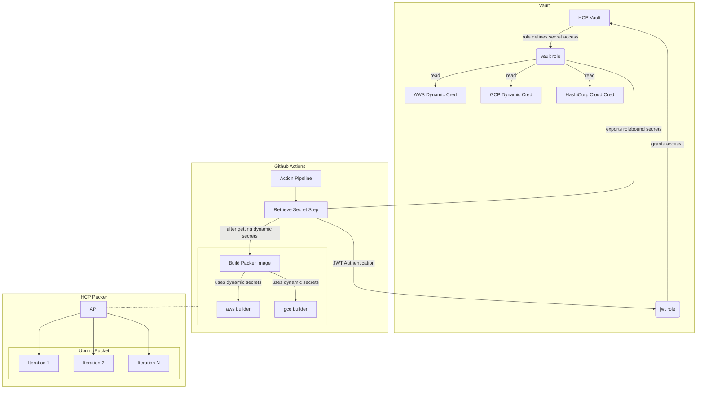

# packer-ubuntu

This repository is a working example of using a GitHub Action to build ubuntu images for AWS and Google Cloud. The outcome is consistent and hardened images for Ubuntu 20.04 on GCP and AWS.

It uses JWT Authentication to take the trusted, encoded values from the GitHub Actions platform and uses them to authenticate to HashiCorp Cloud Platform Vault. Vault generates and retrieves credentials for HCP Packer, AWS, and GCP.

Ansible is used with submodule cloning to personify specific images. These roles align to the CIS benchmark and lock down the ubuntu images.
## Topology

